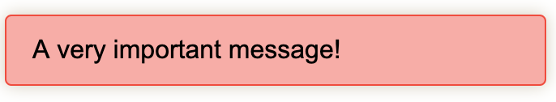
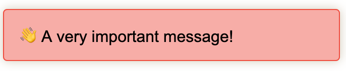
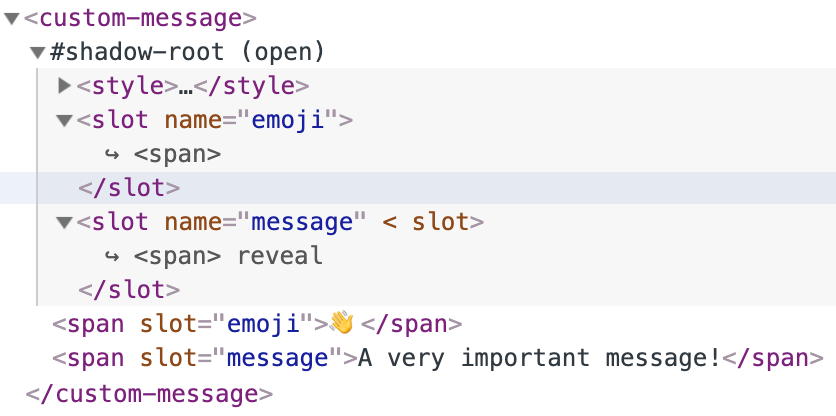
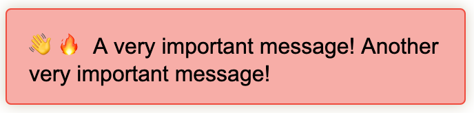

Cover photo credit: [Jacqueline Macou](https://pixabay.com/users/jackmac34-483877)

## Before we get started

This article requires a prior knowledge of Web Components. If you are new to web components, please check out [Part 1](/web-components-part-1) of this series.

## What is a slot?


A slot is a new element introduced for use with Web Components. They allow a consumer to provide content that will be rendered within the [shadow DOM](/web-components-part-1/#shadow-dom) of a Web Component.

Slots are one of the most powerful tools we have to make useful Web Components.

## Why do they matter?

Slots are the primary way for us to build complex Web Components via composition. Breaking down the functionality of a complex object into many small parts has become an important best practice for modern web development.

- How do I get the list of elements into a custom select?
- How can I have a title with an image for a custom section?
- How can I create a nested menu of custom menu items?

These are the types of questions we can answer using the slot tag!

The concept of slots exist across most front-end frameworks:

- Vue - Uses the [slot tag](https://vuejs.org/v2/guide/components-slots.html) in a very similar way to native Web Components
- React - Uses the `props.children` property to [map children down through components](https://reactjs.org/docs/composition-vs-inheritance.html).
- Angular - Calls this process [Content Projection](https://blog.angular-university.io/angular-ng-content/) and uses the `ng-content` tag

## Quick example

Let's take a simple example before diving into the nuances of slots. Let's say we have a custom message box. The consumer of this component will be responsible for providing the messaging.

Here's what our component markup would look like:

```html
<template>
    <style>
        :host { /* We'll discuss :host more in a future post! */
            display: block;
            contain: content;
            border: 1px solid rgba(255, 0, 0, .8);
            background-color: rgba(255, 0, 0, .4);
            border-radius: 4px;
            box-shadow: 0 0 10px rgba(128, 100, 38, 0.34);
            font-family: sans-serif;
            font-size: 16px;
            max-width: 300px;
            padding: 12px 16px;
        }
    </style>
    <slot></slot>
</template>
```

And here's what usage of our component would look like:

```html
<custom-message>
    <span>A very important message!</span>
</custom-message>
```

This example yields a component a consumer can re-use for all of their error messages:



## Named slots

Slots have a `name` attribute that can be used to designate multiple slots. The name on the slot can then be mirrored into the `slot` attribute on the tag intended to occupy that slot. This gives us the control to have a lot of different content flow into a component in a controlled manner.

Alongside named slots we can have a _default_ slot.  This slot will be the catch-all for any content not placed into a named slot. In our quick example the slotted content went into the _default_ slot.

Let's say we wanted to enhance our previous example with a slot for an emoji to the left of the message.

```html
<template>
    <style>
        /* same as before */
    </style>
    <slot name="emoji"></slot><slot name="message"></slot>
</template>
```

Usage:

```html
<custom-message>
    <span slot="emoji">👋</span>
    <span slot="message">A very important message!</span>
</custom-message>
```



## Slot nuances

There are a few important nuances you need to be aware of to work with slots effectively.

### Consumer slotted content must be top level

Slots must be top level elements in the consumers html. This limitation has to do with how the elements are mapped into the components shadow DOM. The elements being put into slots are not rendered in the light DOM which means all of them need to be used in the shadow DOM.

Quick example of how things can go wrong:

```html
<custom-message>
    <div>
        <!-- This is not allowed! -->
        <span slot="emoji">👋</span>
    </div>
    <!-- Valid Usage -->
    <span slot="message">A very important message!</span>
</custom-message>
```

Let's take a quick look at the chrome dev tools with our last example to see what's going on.



You can see that inside the shadow dom we have a pointer to the two `span` elements. The shadow DOM does not copy the elements in. Instead it merely references the elements that are outside the shadow DOM. This has the benefit of keeping the consumers references intact, while still allowing the DOM to render the elements as if they are directly inside the shadow DOM.

If we allowed elements inside our component tag that are not referenced in the shadow DOM, the browser would not have a clear way of where and how to render them.

### Multiple elements with named vs unnamed slots

Let's take a look at an example to start this. Below is our same example with the change that the `message` slot is now our _default_ slot.

```html
<template>
    <style>
        /* same as before */
    </style>
    <slot name="emoji"></slot><slot></slot>
</template>
```

Usage:

```html
<custom-message>
    <span>A very important message!</span>
    <span slot="emoji">👋</span>
    <span slot="emoji">🔥</span>
    <span>Another very important message!</span>
</custom-message>
```

Before you scroll down: What do you expect to be rendered here?

.

..

...

....

..... Ready?

Here's what actually gets rendered:



The two emojis are rendered side-by-side and the two messages are rendered side-by-side. Our two slots are going to take the content designated to them, either by name or default, and render all of the content! This means we can have as many elements as we like passed into our different slots!

## Programmatic access to elements

Ok, but what if I need access to the elements in the slot to add an onclick listener?

The custom element rendering the slots can get access to its contents using two different methods:

- `slotElement.assignedNodes()`
- `slotElement.assignedElements()`

These two accessors allow you to get an iterable sequence of nodes/elements to work with. Both methods also support an additional option to get all of the content for all descendent slots. `slotElement.assignedNodes({ flatten: true })` or `slotElement.assignedElements({ flatten: true })` will return an iterable sequence with all slots resolved all the way down the element/node tree.

## Slot change events

Awesome, we can slot in contents and add listeners when we need, but what about when the slotted content changes?

There is an event fired from a slot element when its content changes. The `slotchange` event doesn't have anything useful in the data passed to the event handler currently. The purpose is purely for observability. Knowing when the content changes can allow simple tricks like a small flash to let the consumer know the data they are seeing has changed recently, or more complex work like updating the event listeners you've created for child elements.

## Wrapping up

There was a LOT in this post, and that speaks to the power of slots when building Web Components.

We learned about _default_ slots vs named slots, multiple elements in a single slot, and how to programmatically access slot events and slot contents. In short, you are ready to go out and experiment with slots to start creating composable and re-usable Web Components!

## Part 4 - Styling the shadow DOM (Coming Soon!)
