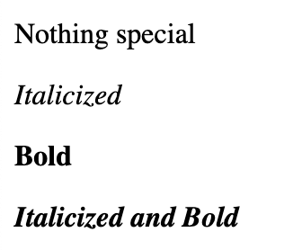
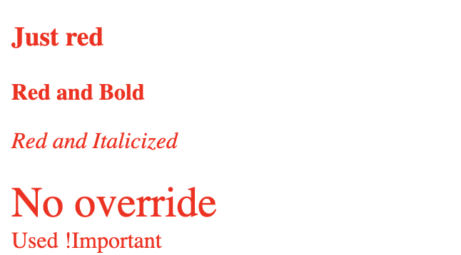

Cover photo credit: [George Pagan III](https://unsplash.com/@gpthree)

## Before we get started

This article requires a prior knowledge of Web Components. If you are new to web components, please check out [Part 1](/web-components-part-1) of this series.

## CSS and the Shadow DOM


Using the shadow DOM introduces a new way of thinking about styling content. The isolation of styles is both a blessing and a curse. We will have much simpler styles to achieve our desired look, but we will lose a lot of control over any slotted content. In this post, I'll do my best to give some guidance on how to best use the new psuedo classes and elements, and where the dark alleys are.

### Major topics covered:

- [What does style isolation really mean?](#what-does-style-isolation-really-mean)
- [CSS custom properties break the boundary](#css-custom-properties-break-the-boundary)
- [Reusing styles](#reusing-styles)
- [:host and :host-context psuedo classes](#host-and-host-context-psuedo-classes)
- [::slotted psuedo element](#slotted-pseudo-element)

## What does style isolation really mean?

When we use the shadow DOM we are creating a separate DOM from the main DOM (light DOM). This means the style tags from the light DOM will not affect elements in the shadow DOM. This, in turn, means we need to have our style tags inside the shadow DOM for them to affect our tags.

```javascript
class StyledHeader extends HTMLElement {
    constructor() {
        this.attachShadow({ mode: 'open' });
        this.shadowRoot.innerHTML = `
        <style>
            h1 {
                color: blue;
            }
        </style>
        <h1>I am styled from the shadow DOM</h1>
        `;
    }
}
```

The example above is all it takes to create a simple component with isolated styles. The `color: blue` will not affect any other **h1** tags in light DOM because we have isolated the style tag inside the shadow DOM.

### Ok. So what about styles from the light DOM?

Styles in the light DOM do not make it into the shadow DOM because it is a completely separate DOM. The shadow DOM is isolated from the light DOMs styles with a few small exceptions we'll get into next.

Look at the example below using our StyledHeader from earlier:

```html
<style>
    h1 {
        color: red;
    }
</style>
<styled-header></styled-header>
```

What color is the **h1** tag from the `<styled-header>`? Think about it before scrolling down.

.

..

...

....

.....

...... Got it?

It's still blue! The style from the light DOM will not make it into the isolated shadow DOM! Now let's dig into the most notable exception to this rule, CSS custom properties.

## CSS custom properties break the boundary

If you are not familiar with CSS custom properties, the [MDN write up](https://developer.mozilla.org/en-US/docs/Web/CSS/Using_CSS_custom_properties) is a great place to start.

Custom properties are a very powerful tool for creating user-customizable web components. The biggest reason is that they break through the shadow DOM boundary! Here a simple example:

```javascript
class StyledHeader extends HTMLElement {
    constructor() {
        this.attachShadow({ mode: 'open' });
        this.shadowRoot.innerHTML = `
        <style>
            h1 {
                color: var(--styled-header-color, blue);
            }
        </style>
        <h1>I am styled from the shadow DOM</h1>
        `;
    }
}
```

```html
<style>
    :root {
        --styled-header-color: green;
    }
</style>
<styled-header></styled-header>
```

The **h1** from the StyledHeader will be *green*! This allows customizability without needing to directly cross the shadow DOM boundary.

## Reusing styles

One of the challenges with isolated styling is duplication. If we have several different components that need the same set of styles we don't want to have those styles isolated to each component. That would be very challenging to maintain, and could easily create inconsistencies in our components.

One solution to this problem is to reuse style tags. The `<template>` tag is our best friend for this type of issue. We can define our shared style in a template that can then be brought into our component for reuse.

```html
<template id="header-reusable-styles">
    <style>
        h1 {
            color: pink;
        }
    </style>
</template>
```

```javascript
class StyledHeader extends HTMLElement {
    constructor() {
        super();

        const styleTemplate = document.querySelector('#header-reusable-styles');
        const styleContent = document.importNode(styleTemplate.content, true);

        this.attachShadow({ mode: 'open' });
        this.shadowRoot.innerHTML = `<h1>I am styled with a reusable template</h1>`;
        this.shadowRoot.appendChild(styleContent);
    }
}
```

With the template in place we can reuse it with any component that needs the same styling treatment without the duplication of code!

## :host and :host-context psuedo classes

We can now style elements inside the shadow DOM from outside using CSS custom properties, but what if we want to style the contents of the component based on properties of the host?

The `:host` psuedo class can help. Using it we can apply different styles depending on what a consumer applies to our custom element tag. A quick example should help to clarify things:

```javascript
class StyledHeader extends HTMLElement {
    constructor() {
        this.attachShadow({ mode: 'open' });
        this.shadowRoot.innerHTML = `
        <style>
            :host(color-red) {
                color: red;
            }
            :host(color-blue) {
                color: blue;
            }
        </style>
        <h1><slot></slot></h1>
        `;
    }
}
```

```html
<styled-header>This text is the default (black)</styled-header>
<styled-header class="color-red">This text is the red</styled-header>
<styled-header class="color-blue">This text is the blue</styled-header>
```

This allows us to apply different styles depending on the styles being applied to the custom element tag. We can go even further than this by gaining knowledge of the tags above our custom element to gain context for rendering.

### :host-context psuedo class

Having context of the parent tags above an element can allow us to differentiate the look and feel for different contexts. A simple example of this would be allowing context to italicize or bold text in our custom element. Consider the following markup:

```html
<context-aware-text>Nothing special</context-aware-text>
<em>
    <context-aware-text>Italicized</context-aware-text>
</em>
<strong>
    <context-aware-text>Bold</context-aware-text>
</strong>
<em>
    <strong>
        <context-aware-text>Italicized and Bold</context-aware-text>
    </strong>
</em>
```

Without the `:host-context` psuedo class we would not have awareness to know if we should be bold, italicized, both, or neither. Here's an example of how we can make this work:

```javascript
class ContextAwareText extends HTMLElement {
    constructor() {
        this.attachShadow({ mode: 'open' });
        this.shadowRoot.innerHTML = `
        <style>
            :host-context(em) {
                font-style: italic;
            }
            :host-context(strong) {
                font-weight: bold;
            }
        </style>
        <h1><slot></slot></h1>
        `;
    }
}
```

The example above should output:



Now we can know about our context and styles from outside the shadow DOM, but what about slotted content?

## ::slotted pseudo element

When we need to apply styles to elements that are slotted in from the light DOM we have to use the `::slotted` psuedo element. Our standard styles in the shadow DOM will not have access to style slotted content because it is not *owned* by the shadow DOM. Using the `::slotted` psuedo element allows us to style slotted content to a limited degree. Let's look at an example:

```javascript
class ContextAwareText extends HTMLElement {
    constructor() {
        this.attachShadow({ mode: 'open' });
        this.shadowRoot.innerHTML = `
        <style>
            ::slotted(*) {
                color: red;
            }
            ::slotted(span) {
                font-weight: bold;
            }
            ::slotted(p) {
                font-style: italic;
            }
            ::slotted(div) {
                font-size: 16px;
            }
            ::slotted(label) {
                font-size: 16px !important;
            }
        </style>
        <slot></slot>
        `;
    }
}
```

Let's break this down one selector at a time.

- `::slotted(*)` will affect ALL slotted elements
- `::slotted(span)` selects only span tags the have been slotted in
- `::slotted(p)` selects only p tags the have been slotted in
- `::slotted(div)` selects only div tags the have been slotted in
- `::slotted(label)` selects only label tags the have been slotted in

Now let's look at the markup:

```html
<slotted-content><h3>Just red</h3></slotted-content>
<slotted-content><span>Red and Bold</span></slotted-content>
<slotted-content><p>Red and Italicized</p></slotted-content>
<style>
    div {
        font-size: 30px
    }
</style>
<slotted-content><div>No override</div></slotted-content>
<style>
    label {
        font-size: 30px
    }
</style>
<slotted-content><label>Used !important</label></slotted-content>
```

Take a minute to think about each example.

.

..

...

....

.....

...... Ready to see what really happened?



Most of this is pretty straight forward, but what happened with the `div` and `label`?

There's a conflict in styles from the light DOM to the shadow DOM. This is a conflict we would generally solve with specificity in the light DOM, but unfortunately we don't have a facility to tackle this when crossing the shadow DOM/light DOM boundary.

There's a good explanation from an [issue thread in the w3c standards repo](https://github.com/w3c/csswg-drafts/issues/2290#issuecomment-382465643). It's not a simple problem to solve. The result of this is that we cannot override styles that are established in the light DOM from the shadow DOM without using `!important`, the most dreaded part of the CSS spec.

## Wrapping things up

Styling custom elements using the shadow DOM is both really simple and extremely complex depending on the scenario you are trying to tackle. Knowing about the rough edges will be important as you begin to tackle more and more complex scenarios in your own code base.
