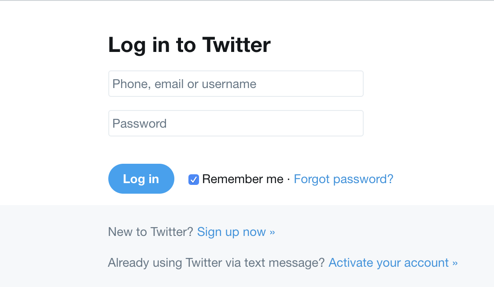

###### Cover photo credit: [twinsfisch](https://unsplash.com/@twinsfisch)

Finite State Machines are a pattern that has been around for a long time. The basic idea is that a given component or set of components can only exist in a single state at a time. The state they exist in is based on events that can trigger the component to move between states.

The simplest example of this is a toggle switch. The switch state can either be "on" or "off". The events that causes this state to change is a "toggle" event. Two states, one event, and nothing else.

This applies to a UI very nicely. Let's take a real world example from Google. The state of the "App Tray" is in a closed state. When the user clicks on it, the tray opens. If the user clicks away from it, or clicks the icon again, the tray closes.

This is exactly like our light switch! Two states, one event. Our two states are "open" and "closed", and our one event is a "toggle" event that can be fired in a few different ways.

## Simplicity is great, but what about complex scenarios

Believe it or not, this is where Finite State Machines really shine! Let's take a look at a login form:

Looks simple enough, but there are a lot of different states this form can be in:

- Initial State
- Invalid Input
- Submitted
- Error
- Success

Each of these states has a different representation in the UI, and each has different logic needed to handle
