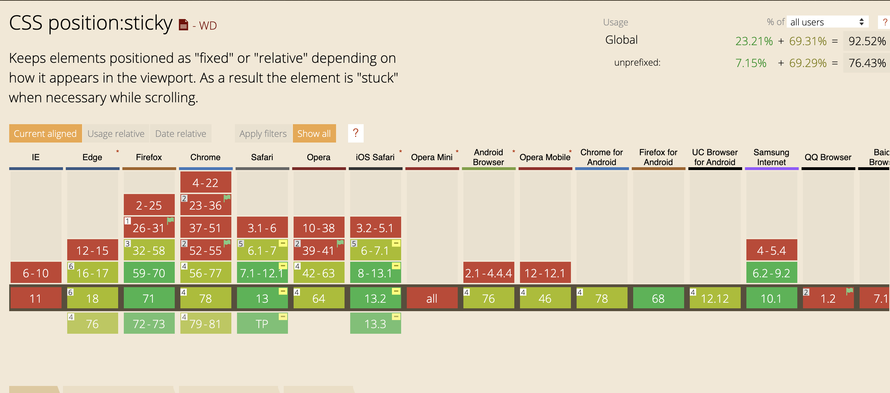

###### Cover photo credit: [Mae Mu](https://unsplash.com/@picoftasty)

At some point in your career as a web developer you will be asked to "just make it stay at the top while they scroll." This has been something javascript has solved for us in past, but no more! `position: sticky` to the rescue!

# Just make it stay at the top

`position: sticky` is the answer to solving this problem, but how does it work?

Basically, an element with `position: sticky` is treated like `position: relative` until the block that contains it crosses a specific threshold. This is usually done by setting either `top` or `left` to a specific value at which point it "sticks" in that position.

Here's a quick example:

<iframe height="373" style="width: 100%;" scrolling="no" title="Basic Position Sticky" src="https://codepen.io/terodox/embed/preview/BaymMVB?height=373&theme-id=default&default-tab=html,result" frameborder="no" allowtransparency="true" allowfullscreen="true">
  See the Pen <a href='https://codepen.io/terodox/pen/BaymMVB'>Basic Position Sticky</a> by Andy Desmarais
  (<a href='https://codepen.io/terodox'>@terodox</a>) on <a href='https://codepen.io'>CodePen</a>.
</iframe>

If you scroll the container you'll notice that the header sticks to the top!

Just setting `position: sticky` and `top: 0` create the behavior you're seeing. That's it!

# Stacking sticky headers

Let's look at another example, a contact list. We want the current first letter of the names we are looking at to be pinned to the top. This might seem more tricky, but it's actually very similar. It turns out that you can have multiple elements set to be stick and they will naturally supersede one another! The same two properties solve this problem as well!

<iframe height="358" style="width: 100%;" scrolling="no" title="Stacked Position Sticky" src="https://codepen.io/terodox/embed/preview/WNbXPar?height=358&theme-id=default&default-tab=css,result" frameborder="no" allowtransparency="true" allowfullscreen="true">
  See the Pen <a href='https://codepen.io/terodox/pen/WNbXPar'>Stacked Position Sticky</a> by Andy Desmarais
  (<a href='https://codepen.io/terodox'>@terodox</a>) on <a href='https://codepen.io'>CodePen</a>.
</iframe>

This can come in handy for other use cases like section headers.

# Sticking to the bottom

This works well for headers, but what about a footer? This one is just as simple as the first two, swap out setting `top: 0` for 'bottom: 0` and you're good to go!

<iframe height="349" style="width: 100%;" scrolling="no" title="Sticky Footer" src="https://codepen.io/terodox/embed/preview/xxbPMez?height=349&theme-id=default&default-tab=css,result" frameborder="no" allowtransparency="true" allowfullscreen="true">
  See the Pen <a href='https://codepen.io/terodox/pen/xxbPMez'>Sticky Footer</a> by Andy Desmarais
  (<a href='https://codepen.io/terodox'>@terodox</a>) on <a href='https://codepen.io'>CodePen</a>.
</iframe>

Footers have never been easier to create!

# What about left and right?

These apply the exact same way as header and footer, just set `left: 0` or `right: 0`. Then with a horizontally scrolling section you can have sections stick to the left or right!

<iframe height="375" style="width: 100%;" scrolling="no" title="Sticky Left and Right" src="https://codepen.io/terodox/embed/preview/abzVXgG?height=375&theme-id=default&default-tab=css,result" frameborder="no" allowtransparency="true" allowfullscreen="true">
  See the Pen <a href='https://codepen.io/terodox/pen/abzVXgG'>Sticky Left and Right</a> by Andy Desmarais
  (<a href='https://codepen.io/terodox'>@terodox</a>) on <a href='https://codepen.io'>CodePen</a>.
</iframe>

This can come in handy for creating things like slide shows where content naturally flows horizontally.

# Browser compatibility

The nice things about `position: sticky` is that it's a true progressive enhancement. In every use case we've discussed it doesn't break functionality. It simply makes it a better user experience. This means our friends using IE11 will not be missing any critical functionality, they just won't get the best user experience we have to offer.

Compatibility looks like this:

# It's awesome

So the quick summary is, it's AWESOME. `position: sticky` is solving a problem that would otherwise require javascript to fix.  It's well supported and easy to use. Now get out there and make things sticky! ...That didn't come out right.
